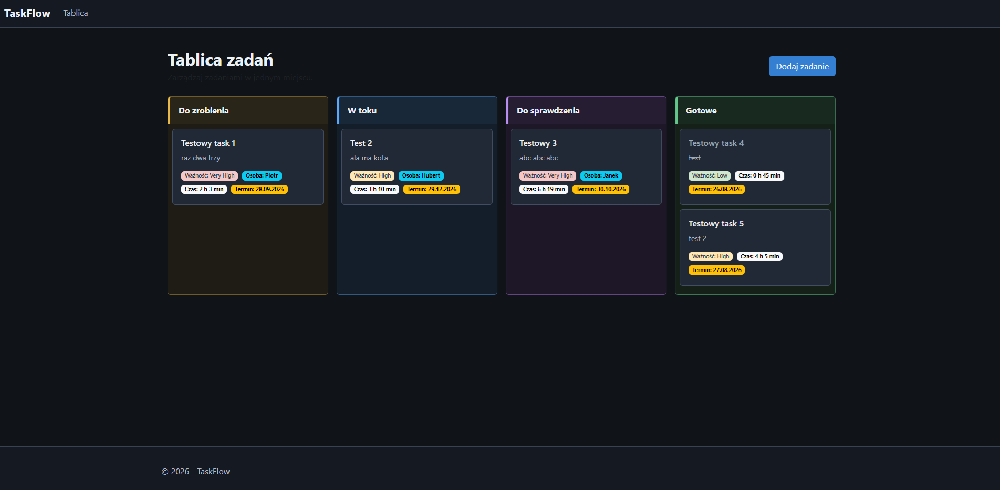
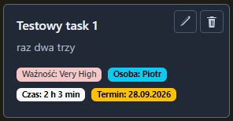
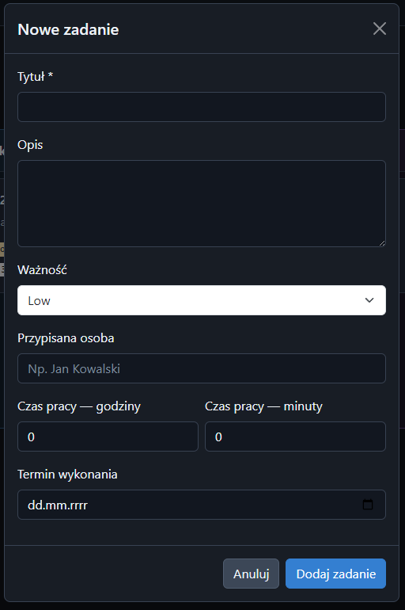
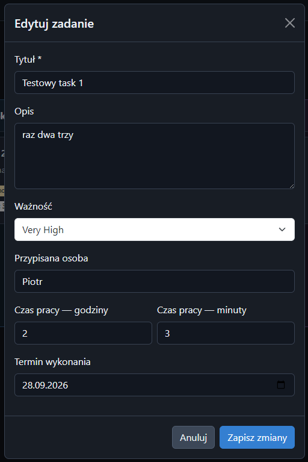

# TaskFlow

TaskFlow to aplikacja webowa do zarządzania zadaniami w formie tablicy Kanban.
Projekt został stworzony w .NET 10 z wykorzystaniem ASP.NET Core MVC, widoków Razor, C#, JavaScript, CSS, Bootstrap oraz Entity Framework Core z SQL Serverem.

---

## Preview









---

## Polski

### Najważniejsze funkcje

* Tworzenie, edycja i usuwanie zadań
* Przeciąganie zadań między kolumnami tablicy Kanban
* Statusy zadań: Todo, InProgress, Review, Done
* Priorytety: Low, Medium, High, VeryHigh
* Przypisywanie osoby do zadania
* Zapisywanie przepracowanego czasu w godzinach i minutach
* Ustawianie i edycja terminu wykonania
* Wyświetlanie priorytetu, osoby, czasu pracy i terminu na kartach zadań
* Walidacja danych formularzy
* Obsługa operacji na zadaniach za pomocą AJAX

---

### Technologie

* C#
* .NET 10
* ASP.NET Core MVC
* Razor
* Entity Framework Core
* SQL Server
* JavaScript
* HTML5
* CSS3
* Bootstrap
* AJAX

---

### Struktura projektu

```text
Controllers/                    - kontrolery MVC i endpointy API
Models/                         - modele zadań oraz enumy
Data/                           - kontekst Entity Framework Core
Migrations/                     - migracje bazy danych
Views/                          - widoki Razor tablicy Kanban i kart zadań
wwwroot/js/kanban.js            - obsługa interakcji i komunikacji AJAX
wwwroot/css/site.css            - główne style aplikacji
wwwroot/lib/bootstrap/          - pliki Bootstrap
appsettings.json                - konfiguracja aplikacji i połączenia z bazą
```

Dane zadań są przechowywane w tabeli `Tasks` w bazie danych `TaskFlowDb`.

---

### Licencja

MIT

---

## English

### Overview

TaskFlow is a web application for task management using a Kanban board.
The project was built with .NET 10 using ASP.NET Core MVC, Razor views, C#, JavaScript, CSS, Bootstrap, and Entity Framework Core with SQL Server.

---

### Features

* Create, edit, and delete tasks
* Drag and drop tasks between Kanban board columns
* Task statuses: Todo, InProgress, Review, Done
* Task priorities: Low, Medium, High, VeryHigh
* Assign a person to a task
* Track time spent in hours and minutes
* Set and edit task due dates
* Display priority, assignee, time spent, and due date on task cards
* Form data validation
* AJAX-based task operations

---

### Tech Stack

* C#
* .NET 10
* ASP.NET Core MVC
* Razor
* Entity Framework Core
* SQL Server
* JavaScript
* HTML5
* CSS3
* Bootstrap
* AJAX

---

### Project structure

```text
Controllers/                    - MVC controllers and API endpoints
Models/                         - task models and enums
Data/                           - Entity Framework Core context
Migrations/                     - database migrations
Views/                          - Razor views for the Kanban board and task cards
wwwroot/js/kanban.js            - interactions and AJAX communication
wwwroot/css/site.css            - main application styles
wwwroot/lib/bootstrap/          - Bootstrap files
appsettings.json                - application and database configuration
```

Task data is stored in the `Tasks` table in the `TaskFlowDb` database.

---

### License

MIT
